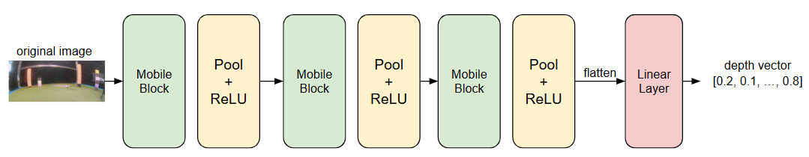

# MAV_depth_estimation

## Table of Contents

- [Introduction](#introduction)
- [Usage](#usage)
  - [Environment Setting](#environment-setting)
  - [Simple Trial](#simple-trial)
  - [Command-Line Arguments](#command-line-arguments)
  - [Running the Code](#running-the-code)
- [Dataset](#dataset)
- [Model Structure](#model-structure)
  - [Model Architecture](#model-architecture)
  - [Output Processing](#output-processing)
  - [Design Goals](#design-goals)
- [References](#references)

## Introduction

This repo is developed for the project of AE4317 Autonomous Flight of Micro Aircraft Vehicles of TU Delft, where the goal was to develop algorithm for the drone to autonomously navigate between obstacles and maximize travel distance within a limited time while avoiding crashes.

The drone participated in the competition and secured 1st place, despite not achieving the longest distance traveled (255m vs. 344m from another team). A large focus on robustness ensured that the drone completed the challenge without any crashes, which secured the victory. The approach is based on a neural network for depth estimation, followed by a cost-function-based control strategy, designed to balance safe navigation with smooth and fast flight paths. By prioritizing collision-free paths while maintaining forward motion, this method proved to be very robust in both simulated and real-world tests.

This repo contains the whole implementation of the depth estimation model. For the guidance part you can check 
[here](https://github.com/akstamimech/paparazzi/tree/team1) in the $team5$ branch.

## Usage

### Environment setting

Run the following command to install all the required libraries.

`pip install -r requirements.txt`

### Simple trial

If you simply want to try the final evaluation, here's the command. Be sure to run it after you install all the requirements.

`python main.py --mode eval --model_id 15`

### Command-Line Arguments

The code accepts the following command-line arguments:

- `--mode`: Specifies the mode of operation. Possible values are `data`, `save_uyvy`, `save_yuv`, `train`, and `eval`.
  - `data`: Preprocess data and store it in the specified format.
  - `save_uyvy`: Convert RGB images to UYVY format and save them as `.npy` files.
  - `save_yuv`: Convert RGB images to YUV format and save them as `.npy` files.
  - `train`: Train the depth estimation model.
  - `eval`: Evaluate the depth estimation model.
- `--h5file`: Specifies the name of the H5 file to be used for data preprocessing.
- `--add_data`: Boolean flag to indicate whether to add new data during preprocessing. Default is `True`.
- `--checkpoint`: Path to the checkpoint file to load the model weights from.
- `--model_id`: Specifies the model ID for evaluation. Default is `0`.

### Running the code

1. Data Prepossing

Make sure you have all the original image under the 'data/original_image' folder and the h5 file under the 'data/h5'. If you have other path, you can change it in config['image_path'].

To convert the raw data from h5 file format to depth tensor, run the following command:

`python main.py --mode data --h5file "The real h5 file name"`

To convert the original image to yuv format, run the following command: 

`python main.py --mode save_yuv`

2. Training

To train the model, use the following command:

`python main.py --mode train`

You can optionally specify a checkpoint file to resume training from a saved state:

`python main.py --mode train --checkpoint path/to/checkpoint.pth`

3. Evaluation

To evaluate the model, use the following command:

`python main.py --mode eval --model_id model_id`, for example `python main.py --mode eval --model_id 9`

4. Simple test by loading image & depth map comparison

To simply load a random pair of image and depth map for comparison, use the following command:

`python main.py`

## Dataset 

The dataset is constructed using raw images captured by a drone camera and sourced from the [TimDB/AE4317-cyberzoo-tudelft dataset](https://huggingface.co/datasets/Timdb/AE4317-cyberzoo-tudelft). 

Key steps include:

1. Depth Generation: Depth matrices are generated using the Depth Anything V2 model after undistorting raw images.

2. Depth Vector Extraction:

    - Focus on the central region of the image (±15% around the middle row).
    - Divide the columns into 16 regions and select the maximum depth value from each region.
    - Resulting in a 16-dimensional depth vector as ground truth.

## Model Structure

To achieve the desired task of efficient depth vector estimation, we propose a fully convolutional neural network architecture inspired by Zheng et al. [^1], as illustrated in Figure below.

The model processes an original image captured by the drone camera as input and predicts a 16-dimensional depth vector corresponding to the central region of the image.

### Model Architecture

The architecture sequentially combines three **mobile blocks**[^2], each followed by an **average pooling layer** for downsampling and a **ReLU activation function** to introduce non-linearity (see Section 3 for implementation specifics). The mobile blocks efficiently extract spatial and depth features through lightweight convolutions, while the pooling operations progressively reduce spatial dimensions to focus on robust hierarchical representations.

#### Output Processing

The output from the final mobile block is flattened into a 1D feature vector, which is then passed through a **fully connected linear layer**. This layer maps the high-dimensional features to the target 16-dimensional depth vector, represented as:

$$
\mathbf{d} = [d_1, d_2, \ldots, d_{16}]
$$

where each $d_i \in [0, 1]$ quantifies the normalized depth estimate at a specific spatial location in the image center.

### Design Goals

The design emphasizes **computational efficiency** and **feature relevance**, making it suitable for real-time depth estimation on resource-constrained drone platforms.

[^1]: Zheng et al. (2023). Monocular Depth Estimation for Drone Obstacle Avoidance in Indoor Environments.
The model is inherited and modified from the paper [Monocular Depth Estimation for Drone Obstacle Avoidance in Indoor
Environments](https://www-video.eecs.berkeley.edu/papers/Drone_Paper_V_Final.pdf). 

[^2]:Howard, A. G., Zhu, M., Chen, B., Kalenichenko, D., Wang, W., Weyand, T., … Adam, H. (2017). MobileNets: Efficient Convolutional Neural Networks for Mobile Vision Applications. CoRR, abs/1704.04861. Retrieved from http://arxiv.org/abs/1704.04861