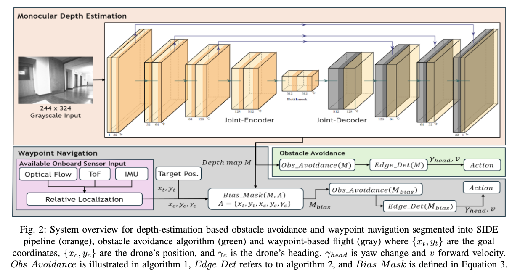

# MAV_depth_estimation

## Usage

### Environment setting

Run the following command to install all the required libraries.

`pip install -r requirements.txt`

### Command-Line Arguments

The code accepts the following command-line arguments:

- `--mode`: Specifies the mode of operation. Possible values are `data`, `save_uyvy`, `save_yuv`, `train`, and `eval`.
  - `data`: Preprocess data and store it in the specified format.
  - `save_uyvy`: Convert RGB images to UYVY format and save them as `.npy` files.
  - `save_yuv`: Convert RGB images to YUV format and save them as `.npy` files.
  - `train`: Train the depth estimation model.
  - `eval`: Evaluate the depth estimation model.
- `--h5file`: Specifies the name of the H5 file to be used for data preprocessing.
- `--add_data`: Boolean flag to indicate whether to add new data during preprocessing. Default is `True`.
- `--checkpoint`: Path to the checkpoint file to load the model weights from.
- `--model_id`: Specifies the model ID for evaluation. Default is `0`.

### Running the code

1. Data Prepossing

Make sure you have all the original image under the 'data/original_image' folder and the h5 file under the 'data/h5'. If you have other path, you can change it in config['image_path'].

To convert the raw data from h5 file format to depth tensor, run the following command:

`python main.py --mode data --h5file "The real h5 file name"`

To convert the original image to yuv format, run the following command: 

`python main.py --mode save_yuv`

2. Training

To train the model, use the following command:

`python main.py --mode train`

You can optionally specify a checkpoint file to resume training from a saved state:

`python main.py --mode train --checkpoint path/to/checkpoint.pth`

3. Evaluation

To evaluate the model, use the following command:

`python main.py --mode eval --model_id model_id`, for example `python main.py --mode eval --model_id 9`

4. Simple test by loading image & depth map comparison

To simply load a random pair of image and depth map for comparison, use the following command:

`python main.py`

## Dataset 

// TODO

## Model Structure

// TODO

The model is inherited and modified from the paper [Monocular Depth Estimation for Drone Obstacle Avoidance in Indoor
Environments](https://www-video.eecs.berkeley.edu/papers/Drone_Paper_V_Final.pdf). 

These're the modificaitons I have made to adjust our tasks:

1. Concat the original image and depth map in the first dimension as "rgb+d" tensor to serve as the input.

2. Ignore the 5-layer Joint encoder and decoder since I don't know how exactly the 5 layers are connected and that may even double the model size. Given our limited cpu and memory, I opt to use a 2-layer connection.

3. For the last three layer representively in encoder and decoder, I directly implemented residual cnnection to aid in construction without using the upscale algorithm talked in the paper.